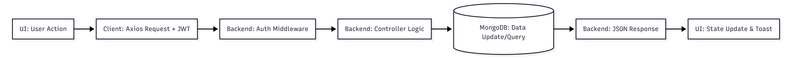
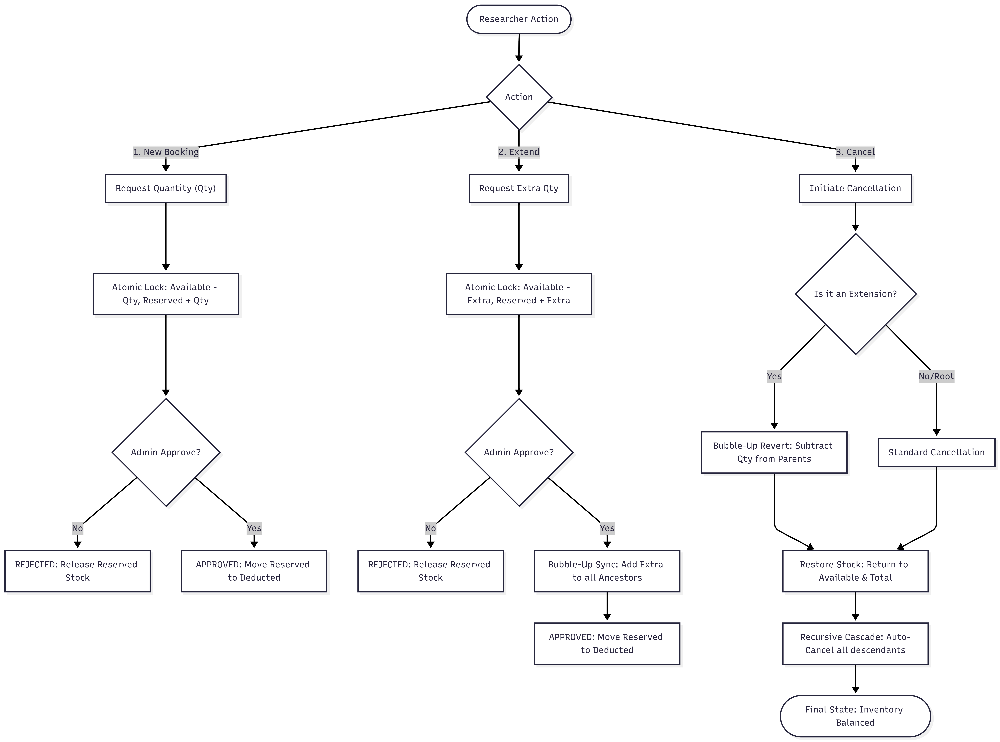
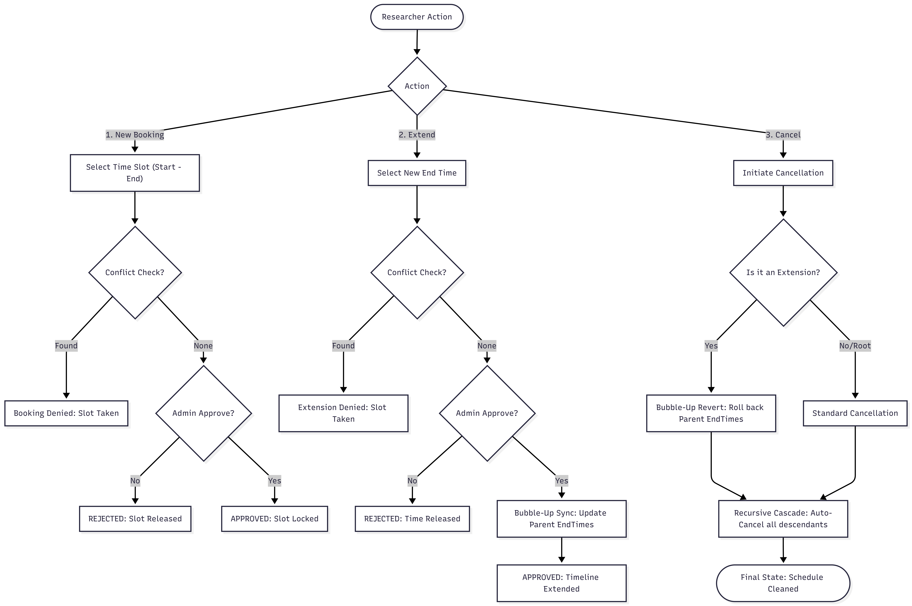

# 🧪 Laboratory Resource Management System

## 🖥️ Panel Workflows

### **Admin Panel**
The Admin Panel is the control center for the lab.
- **Resource Management**: Create, Update, and Delete instruments and materials.
- **Approval System**: View all `PENDING` bookings from researchers and choose to **Approve** (deducts stock) or **Reject** (releases stock).
- **Global Overview**: Monitor the status of all lab assets and their usage history across the entire team.

### **User (Researcher) Panel**
The Researcher Panel is focused on discovery and requests.
- **Resource Discovery**: Search for instruments or materials and check real-time availability.
- **Booking**: Submit requests for specific time-slots (instruments) or quantities (materials).
- **My History**: Track the status of their own bookings (Pending, Approved, Rejected) and request **Extensions** or **Cancellations**.


## 🧠 Design Notes

### 1. Stopping "Ghost" Stock (The Reserved Pool)
In a busy lab, we can't have two people trying to use the last bottle of chemicals at the same time. To fix this, I built a "Reserved" system. 
- **How it works**: The moment a researcher asks for an amount, the system "locks" it by moving it from the *Available* pile to a *Reserved* pile. 
- **The Benefit**: Even if the admin hasn't approved the request yet, that stock is already taken so no one else can grab it. If the admin rejects the request, the system just puts the stock back in the *Available* pile. This keeps the inventory 100% accurate.

### 2. No More Double-Booking
For expensive machines, I used a simple math check in the database to make sure no two bookings overlap. 
- **How it works**: It checks if a new request's start time is before an existing booking's end time, and if the new end time is after the old start time. 
- **The Benefit**: This catches every possible mistake, even if two people click "Book" at the exact same second. It's much safer than just checking the dates on the frontend.

### 3. Proper Hierarchical Tracking (Parent-Child Tree)
- **How it works**: I implemented a true hierarchical tree structure. Every extension is linked to its immediate parent, and all approvals "bubble up" to the root.
- **The Benefit**: This keeps the history 100% clean and professional. Lab managers can see the exact sequence of modifications, while the system automatically ensures the root booking reflects the total time and quantity used across the entire chain.
- **Auto-Linear Chaining**: The system is smart enough to automatically find the latest extension and link new requests to it, ensuring a perfect linear audit trail (Root → Ext 1 → Ext 2).

### 4. Why We Chose a Single "Unified" Booking Schema
Instead of creating two separate databases for "Instrument Bookings" and "Material Bookings", I decided to combine them into one unified schema (`Booking.model.js`).
- **How it solves complex problems**: In a lab, a researcher often needs a machine *and* the chemicals to run it. By keeping all requests in one place, the backend API is significantly simpler. We don't have to write duplicate code for approvals, cancellations, and extensions.
- **How it makes it easy for the user**: Because all bookings live together, the frontend can fetch everything in a single API call and show the researcher a beautifully unified "History Table." Admins also get a single "Approvals Dashboard" where they can see requests for microscopes right next to requests for saline solutions, making their daily job much faster.


## 🔄 System Flow Diagrams

### 📡 Generic API Request Flow


#### 🧪 Material Resource Lifecycle (Booking, Extension, Cancellation)
This diagram provides a complete overview of how material quantities are managed, deducted, and reverted throughout their entire lifecycle.



##### 🧪 Hierarchical Example (Material Chain)
This example demonstrates a 3-level extension chain and how the system handles a **Middle-Link Cancellation**.

| Step | Action | Root Qty | Ext 1 Qty | Ext 2 Qty | Ext 3 Qty | Lab Total |
| :--- | :--- | :--- | :--- | :--- | :--- | :--- |
| **0** | Initial | 0 | - | - | - | 1000kg |
| **1** | Book Root (10kg) | **10kg** | - | - | - | 990kg |
| **2** | Extend Ext 1 (+10kg) | **20kg** | 10kg | - | - | 980kg |
| **3** | Extend Ext 2 (+20kg) | **40kg** | 30kg | 20kg | - | 960kg |
| **4** | Extend Ext 3 (+10kg) | **50kg** | 40kg | 30kg | 10kg | 950kg |
| **5** | **Cancel Ext 2** | **20kg** | **10kg** | **X** | **X** | **990kg** |

**Why did this happen?**
When **Ext 2** was cancelled, the system performed a **Recursive Rollback**:
1. It identified that **Ext 2** contributed **30kg** to the chain (itself + child Ext 3).
2. It subtracted **30kg** from all ancestors (Ext 1 and Root).
3. It recursively marked **Ext 2** and **Ext 3** as `CANCELLED`.
4. It returned **30kg** to the Lab Inventory.
5. **Result**: The chain was safely "cut" at the point of cancellation, preserving the original 10kg + 10kg history.


#### ⏱️ Instrument Resource Lifecycle (Booking, Extension, Cancellation)
This diagram shows how time slots are reserved, extended, and cleaned up to prevent overlaps and ensure a contiguous timeline.



##### ⏱️ Timeline Example (Instrument Chain)
Tracking a single machine through multiple extensions and a **Middle-Link Cancellation**.

| Step | Action | Root Timeline | Ext 1 | Ext 2 | Ext 3 | Global State |
| :--- | :--- | :--- | :--- | :--- | :--- | :--- |
| **0** | Initial | - | - | - | - | Slot Available |
| **1** | Book Root | **10am - 11am** | - | - | - | 1hr Locked |
| **2** | Extend Ext 1 | **10am - 12pm** | 11am-12pm | - | - | 2hrs Locked |
| **3** | Extend Ext 2 | **10am - 02pm** | 11am-12pm | 12pm-02pm | - | 4hrs Locked |
| **4** | Extend Ext 3 | **10am - 03pm** | 11am-12pm | 12pm-02pm | 02pm-03pm | 5hrs Locked |
| **5** | **Cancel Ext 2** | **10am - 12pm** | 11am-12pm | **X** | **X** | **Slot 12pm-3pm released** |

**Why did this happen?**
When **Ext 2** was cancelled, the system ensured **Contiguous Timeline Integrity**:
1. It identified that **Ext 2** ends the chain at **3pm** (because of child Ext 3).
2. It rolled back the ancestors (Ext 1 and Root) to the point where the break occurred (**12pm**).
3. It recursively marked **Ext 2** and **Ext 3** as `CANCELLED`, making those future slots available for other researchers.
4. **Result**: A perfectly clean, gap-free schedule that respects the timeline of the remaining bookings.


## 📂 Project Structure

```text
lab-resource-management/
├── client/                # React + Vite + Tailwind CSS
│   ├── src/
│   │   ├── components/    # Reusable UI (Modals, Tables, Pills)
│   │   ├── pages/         # Page-level components (Dashboard, Approvals, History)
│   │   ├── utils/         # API helpers and common utilities
│   │   └── hooks/         # Custom React hooks (Debounce, etc.)
└── server/                # Express.js + Mongoose
    ├── controllers/       # Business logic (Booking, Materials, Instruments)
    ├── models/            # Database schemas
    ├── routes/            # API endpoint definitions
    ├── middlewares/       # Auth and Role-based protection
    └── utils/             # Centralized constants and common helpers
```


## 🚀 Getting Started

### 1. Prerequisites
- **Node.js**: v18+ recommended.
- **MongoDB**: Local instance running at `mongodb://localhost:27017` or a MongoDB Atlas URI.

### 2. Installation
```bash
# Clone the repository
git clone https://github.com/akshay-092/lab-resource-management-system.git
cd lab-resource-management-system

# Setup Backend
cd server
npm install
cp .env.example .env # Update MONGODB_URI if needed
npm start

# Setup Frontend (In a new terminal)
cd client
npm install
cp .env.example .env # Update VITE_API_BASE_URL if needed
npm run dev
```

### 3. Environment Variables
To run this project, you will need to add the following environment variables to your `.env` files.

#### **Backend (`/server/.env`)**
| Variable | Description | Example |
| :--- | :--- | :--- |
| `SERVER_PORT` | The port the server runs on | `5000` |
| `MONGODB_URI` | Your MongoDB connection string | `mongodb://localhost:27017/lab-db` |
| `JWT_SECRET` | Secret key for token generation | `any_secure_random_string` |

#### **Frontend (`/client/.env`)**
| Variable | Description | Example |
| :--- | :--- | :--- |
| `VITE_API_BASE_URL` | URL of your running backend API | `http://localhost:5000/api` |

### 4. Initial User Setup
Since there is no frontend registration page, you must create users via the API (using Postman, Insomnia, or cURL).

#### **Register an Admin**
```bash
# Method: POST
# URL: http://localhost:5000/api/auth/register
{
  "email": "admin@lab.com",
  "password": "password123",
  "role": "admin"
}
```

#### **Register a Researcher**
```bash
# Method: POST
# URL: http://localhost:5000/api/auth/register
{
  "email": "user@lab.com",
  "password": "password123",
  "role": "user"
}
```


## 📡 API Endpoints

> [!TIP]
> A complete Postman Collection is available in `documents/lab-resource-api-collection.json`. You can import this into Postman to quickly test all endpoints with pre-filled examples.

### Authentication
| Method | Endpoint | Description |
| :--- | :--- | :--- |
| POST | `/api/auth/register` | Create a new account |
| POST | `/api/auth/login` | Authenticate and get JWT |

### Resources (Admin Only for Write)
| Method | Endpoint | Description |
| :--- | :--- | :--- |
| POST | `/api/instruments/create` | Add new instrument |
| POST | `/api/instruments/list` | List with search/pagination |
| POST | `/api/instruments/update` | Update instrument details |
| POST | `/api/instruments/delete` | Remove an instrument |
| POST | `/api/materials/create` | Add new material |
| POST | `/api/materials/list` | List with search/pagination |
| POST | `/api/materials/update` | Update material details |
| POST | `/api/materials/delete` | Remove a material |

### Bookings
| Method | Endpoint | Description |
| :--- | :--- | :--- |
| POST | `/api/bookings/create` | Request a resource |
| POST | `/api/bookings/list` | View booking history |
| POST | `/api/bookings/approve` | (Admin) Approve a request |
| POST | `/api/bookings/reject` | (Admin) Deny a request |
| POST | `/api/bookings/cancel` | Cancel an active/pending booking |
| POST | `/api/bookings/extend` | Request more time/quantity |
| POST | `/api/bookings/resource-history` | View history for a specific resource |


## 💡 Design Question Answers

### Q1: Should every booking need approval?
**Answer: It depends on the item.**
I designed the system to be highly flexible by including a `requiresApproval` Boolean flag in both the Instrument and Material schemas.
- **How the system handles it**: When a booking is created, the backend controller checks this flag. If `true`, the booking status is set to `PENDING`. If `false`, the status is immediately set to `APPROVED`, and stock is deducted instantly.
- **The Logic**: This ensures that critical lab infrastructure remains under strict oversight, while common consumables move quickly through the system without creating administrative bottlenecks.

### Q2: What if a researcher needs more time or quantity?
**Answer: Use a "Linked" request system.**
Instead of allowing direct modification of an existing booking, the system uses an "Extension" workflow that preserves the original data.
- **How the system handles it**: We create a new `Booking` document but link it to the original via a `parentBooking` ID. For instruments, the system runs a "future conflict check" to ensure the extra time doesn't overlap with another slot.
- **The Logic**: This preserves the "Audit Trail." Lab managers can see that a researcher initially asked for 2 hours but eventually used 5, providing valuable data for future procurement.

### Q3: How do you keep the stock numbers accurate?
**Answer: Immediate "Atomic" Locking.**
The system uses an "Immediate Lock" strategy to prevent race conditions (two people booking the same last item at once).
- **How the system handles it**: When a request is submitted, the backend uses an atomic MongoDB operation to decrement `availableQuantity` and increment `reservedQuantity`.
- **The Logic**: By moving stock into a "Reserved" pool *before* admin approval, we ensure that the stock is physically accounted for. If the admin rejects the request, the process is reversed. This prevents "Ghost Stock" errors.

### Q4: Why choose React, Tailwind, Node.js, and MongoDB for this project?
**Answer: A Unified, JSON-Centric Architecture.**
- **React.js (Frontend)**: I chose React for its state-driven UI. In a lab dashboard, data changes constantly. React’s virtual DOM ensures the UI updates instantly and smoothly without full-page refreshes.
- **Tailwind CSS (Styling)**: Tailwind allowed me to build a premium design system without the overhead of a heavy CSS framework. It ensures the dashboard is responsive and follows strict design tokens.
- **Node.js/Express (Backend)**: Using JavaScript across the whole stack simplifies development. Node's non-blocking I/O is perfect for handling multiple simultaneous booking requests.
- **MongoDB (Database)**: Since lab resources vary, MongoDB’s flexible schema is ideal. It allows us to store diverse data shapes without complex SQL joins, making the API significantly faster.
